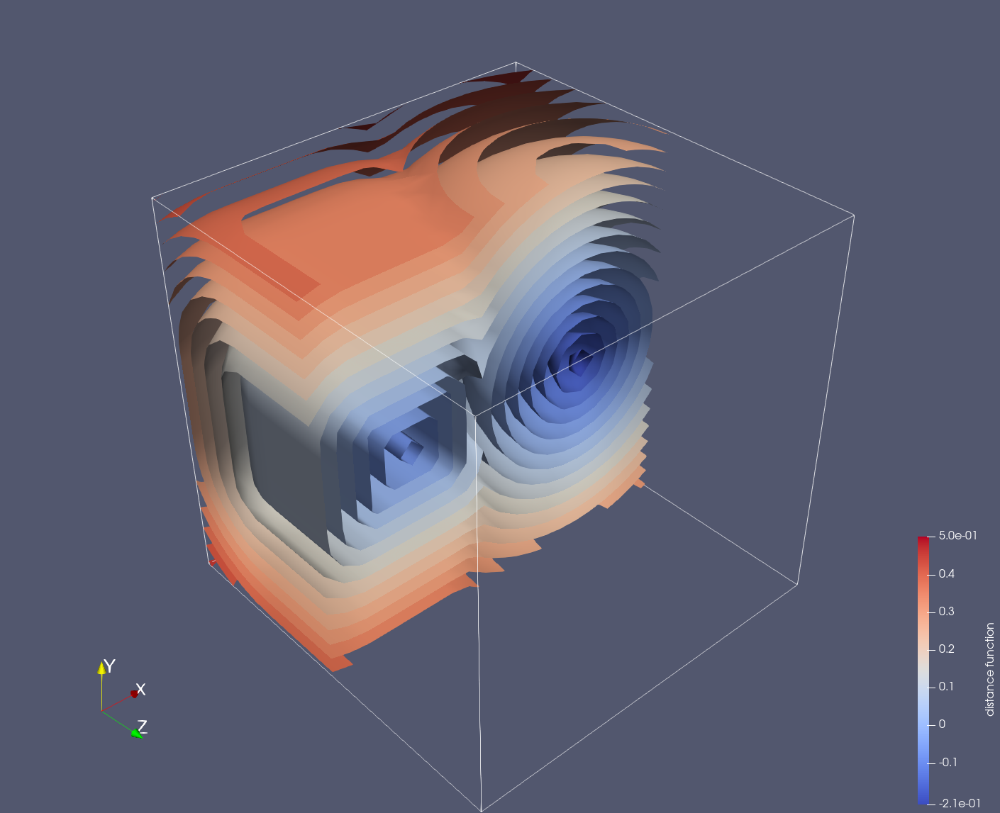

# A Toy Program using Fortran OSS, from JSON input to VTK output

This toy program computes distance functions around simple-shape objects. It uses Fortran OSS such as JSON-Fortran for reading configuration files, stdlib for logging and error checking, and VTKFortran for output.

Fortran OSSを利用したプログラムの作成例．
- [JSON-Fortran](https://github.com/jacobwilliams/json-fortran)を用いてJSONファイルから設定を読込
- [stdlib](https://github.com/fortran-lang/stdlib)を用いてプログラムのロギング，エラーチェック等を実行
- [VTKFortran](https://github.com/szaghi/VTKFortran)を用いてvtrファイルに出力

## 要求ソフトウェア
- fpm
- JSON-Fortran
- Fortran-stdlib
- VTKFortran
- Fortranコンパイラ
    - gfortran
    - Intel oneAPI

## ビルドおよび実行
ビルドおよび実行には[fpm](https://github.com/fortran-lang/fpm)を用いる．

### gfortranによるビルド

```console
fpm build --flag "-D_R16P"
```
を実行してビルドする．ビルドにはオプション`--flag "-D_R16P"`が必要である．VTKFortranの依存するライブラリがこのオプションを必要とするためである．

ビルドが成功した後，次のコマンドによってプログラムを実行する．
```console
fpm run --flag "-D_R16P"
```

### Intel Fortranによるビルド
先述のコンパイルオプションに加えて，コンパイラを選択するオプションが必要である．Linux版のifortでは，コンパイラオプションを示す記号`/`を`-`に変更する．

```console
fpm build --compiler ifort --flag "/fpp /D_R16P"
```

```console
fpm run --compiler ifort --flag "/fpp /D_R16P"
```

## プログラムの動作
1. 設定ファイル`config.json`を読み込む．
1. 領域の広さ，離散点の数を取得し，配列の割付と初期化を行う．
1. 物体の情報（直方体の中心座標と辺の長さ，球の中心座標と半径）を取得し，物体表面までの距離を計算する．
1. 距離関数を，rawエンコーディングのxml-vtr形式で出力する．

## 実行結果


